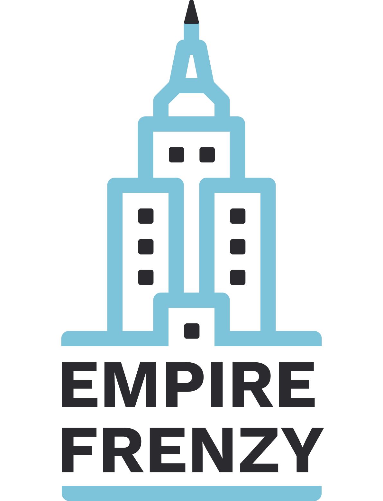

# Empire Frenzy

An online multiplayer spin-off of the popular Monopoly Deal card game.



## Game Walkthrough

## Installation

Use npm to install dependencies for both the server and also the client.

```bash
npm install
cd client
npm install
```

## Intialization

```bash
nodemon #if nodemon is present or just: node server
cd client
yarn start
```

## Folder Structure

### Client

/client is the root for client

/client/src/components is where all following the components are:

- ~/chat: chat related components
- ~/hand: component for rendering hand cards and section
- ~/modal: modal components (cash requests, sly deal, etc)
- ~/play_area: components for Play areas (personal and opponent) as well as individual card components for cash and properties
- ~/players: component for displaying playerlist
- ~/waiting room: component for displaying the waiting room

### Server

- server.js is the entry point. It also contains all the socket listeners
- games.js is where all the game logic is contained. The game state variable is stored here
- deck.js file to export the default deck array

## License

[ISC](https://choosealicense.com/licenses/isc/)
